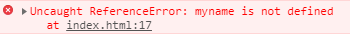
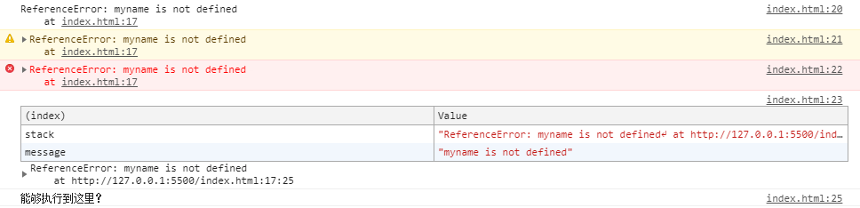

js 我不知道的东西太特么多了，基础不扎实，因此这系列是在日常学习中看到的知识点然后自己作不同的尝试去`扩展与填充自己知识空白部分`

## 从 ES6 声明变量的方式开始
---
声明变量这个东西必须用，但真的了解多少？

### 未声明变量
当我直接输出一个`未声明的变量 myname` 是会报一个**未捕获的错误** `Uncaught ReferenceError: myname is not defined`
```js
var log = '能够执行到这里？';
console.log(myname); // Uncaught ReferenceError: myname is not defined
console.log(log); // 上行代码报错后此行及之后的代码不会继续执行
```



#### 捕获异常
为了不影响后续代码执行，我们需要用 `try catch` 来捕获错误，

```js
// var 的变量提升
var log = '能够执行到这里？'

try {
    console.log(myname);
    alert('不会执行') // 上行代码捕获到异常后此行代码也不会执行
} catch (e) {
    console.log(e); // 日志输出
    console.warn(e); // 警告黄色输出
    console.error(e); // 错误红色输出
    console.table(e); // 表格的方式输出，包含了错误在文件中第几行第几列
}
console.log(log); // 能够执行到这里？ 由于捕获了异常所以可以执行这行代码
```

这里正好用控制台的 4 个 api 来输出错误信息



这里你会看到 `try catch` 后的两点变化
* 代码能继续执行
* **未捕获的错误** `Uncaught ReferenceError` 已经变成 `ReferenceError` 


> 这里有个小插曲，为什么变量要用 `myname` 而不是 `name`，因为 name 是 window 的一个内置属性，值为`空字符串`，所以在未声明 name 的前访问是不会报错，但未声明 myName 则胡报错
```js
console.log(name); // ''
console.log(myName); // Uncaught ReferenceError: myName is not defined
```

代码地址 [git repo](https://github.com/kirin-yuen/js-basic-padding.git)
commit 5c9642bfdfdc73be20543b8c39bddd58ce308bec


================分割线================

### var 声明变量
* 变量提升
* 可重复声明并赋值
```js
// var 声明变量
console.log(log); // var 声明的变量会变量提升，因此这里不会报错而是输出默认值 undefined
var log = '存在'
console.log(log); // 存在
var log = "已成功改变"; // 可重复声明 var，不会报错
console.log(log); // 已成功改变
var log; // 不赋值不改变值
console.log(log); // 已成功改变
```

### let 声明变量
* **变量不会提升**
* **不可重复声明并赋值**
```js
// var 声明变量
console.log(log); // var 声明的变量会变量提升，因此这里不会报错而是输出默认值 undefined
var log = '存在'
console.log(log); // 存在
var log = "已成功改变"; // 可重复声明 var，不会报错
console.log(log); // 已成功改变
var log; // 不赋值不改变值
console.log(log); // 已成功改变

// let 声明变量
console.log(log1); // 不能在用 let 声明变量前访问 Uncaught ReferenceError: Cannot access 'log1' before initialization，let 声明的变量不存在提升
let log1 = 'let 声明的变量'; 

let log = '修改 var 变量的值'; // 不可重复声明 var 或 let 声明过的变量 Uncaught SyntaxError: Identifier 'log' has already been declared， SyntaxError 会导致整个程序不运行

// 无论是 var 还是 let 声明过的变量，都不能重复声明
let log1 = '重新赋值'; // Uncaught SyntaxError: Identifier 'log1' has already been declared
let log = '重新赋值'; // Uncaught SyntaxError: Identifier 'log' has already been declared
```

进入语法分析时:
* 如果**语法错误**`SyntaxError`，则整个程序不会运行;
* 如果**引用错误**`ReferenceError`，只会导致错误后面的代码无法执行;